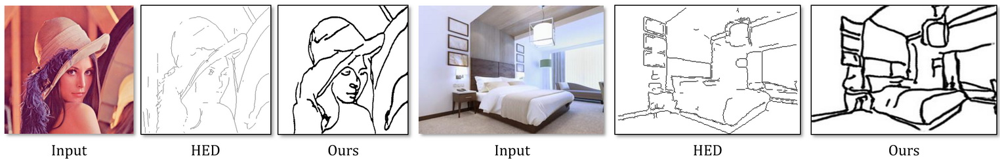
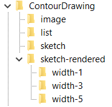

# Photo-Sketching: Inferring Contour Drawings from Images

<p align="center"></p>

This repo contains the training & testing code for our sketch generator. We also provide a [[pre-trained model]](https://drive.google.com/file/d/1TQf-LyS8rRDDapdcTnEgWzYJllPgiXdj/view).

For technical details and the dataset, please refer to the [**[paper]**](https://arxiv.org/abs/1901.00542) and the [**[project page]**](http://www.cs.cmu.edu/~mengtial/proj/sketch/).

# Setting up

The code is now updated to use PyTorch 0.4 and runs on Windows, Mac and Linux. For the obsolete version with PyTorch 0.3 (Linux only), please check out the branch [pytorch-0.3-obsolete](../../tree/pytorch-0.3-obsolete).

Windows users should find the corresponding `.cmd` files instead of `.sh` files mentioned below.

## One-line installation (with Conda environments)
`conda env create -f environment.yml`

Then activate the environment (sketch) and you are ready to go!

See [here](https://conda.io/docs/user-guide/tasks/manage-environments.html) for more information about conda environments.

## Manual installation
See `environment.yml` for a list of dependencies.

# Using the pre-trained model

- Download the [pre-trained model](https://drive.google.com/file/d/1TQf-LyS8rRDDapdcTnEgWzYJllPgiXdj/view)
- Modify the path in `scripts/test_pretrained.sh`
- From the repo's **root directory**, run `scripts/test_pretrained.sh`

It supports a folder of images as input.

# Train & test on our contour drawing dataset

- Download the images and the rendered sketch from the [project page](http://www.cs.cmu.edu/~mengtial/proj/sketch/)
- Unzip and organize them into the following structure:
<p align="center"></p>

- Modify the path in `scripts/train.sh` and `scripts/test.sh`
- From the repo's **root directory**, run `scripts/train.sh` to train the model
- From the repo's **root directory**, run `scripts/test.sh` to test on the val set or the test set (specified by the phase flag)

## Citation
If you use the code or the data for your research, please cite the paper:

```
@article{LIPS2019,
  title={Photo-Sketching: Inferring Contour Drawings from Images},
  author={Li, Mengtian and Lin, Zhe and M\v ech, Radom\'ir and and Yumer, Ersin and Ramanan, Deva},
  journal={WACV},
  year={2019}
}
```

## Acknowledgement
This code is based on an old version of [pix2pix](https://github.com/junyanz/pytorch-CycleGAN-and-pix2pix/).

